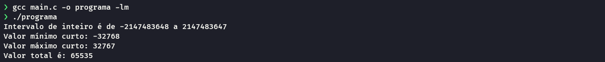

## Flags de impressão


- `%d` Usado para imprimir valores inteiros de uma váriavel

- `%lu` Usado para imprimir valores inteiros com sinais grandes.

- `%lu` Usado para imprimir valores inteiros sem sinal representados pelo tipo unsigned long int.

- `%u` Usado para imprimir valores inteiros sem sinal representados pelo tipo unsigned long int.

- `sizeof()` Um operador que retorna o tamanho em bytes de um tipo de dado ou variável. 

## Bibliotecas

### Limits
- `include <limits.h>` Esse arquivo de cabeçalho tem algumas constantes simbólicas que são úteis para determinar os valores mínimos e máximos 
  Essas macros definem valores mínimos e máximos para variáveis do tipo inteiro e curto em C:

- `INT_MIN`: representa o valor mínimo que pode ser armazenado em uma variável do tipo `int`. Geralmente é -2147483648 em sistemas de 32 bits e -9223372036854775808 em sistemas de 64 bits.
- `INT_MAX`: representa o valor máximo que pode ser armazenado em uma variável do tipo `int`. Geralmente é 2147483647 em sistemas de 32 bits e 9223372036854775807 em sistemas de 64 bits.
- `USHRT_MAX`: representa o valor máximo que pode ser armazenado em uma variável do tipo `unsigned short int`. Geralmente é 65535.
- `SHRT_MAX`: representa o valor máximo que pode ser armazenado em uma variável do tipo `short int`. Geralmente é 32767.
- `SHRT_MIN`: representa o valor mínimo que pode ser armazenado em uma variável do tipo `short int`. Geralmente é -32768.

Esses valores são úteis em situações em que é necessário verificar o tamanho máximo ou mínimo dos valores armazenados em variáveis inteiras e curtas, ou para garantir que as operações aritméticas com esses tipos de dados não ultrapassem seus limites.

#### Exemplo:
  ```c
  #include <stdio.h>
  #include <limits.h>

  int main(){
    int min = INT_MIN;
    int max = INT_MAX;
    short int minShort = SHRT_MIN;
    short int maxShort = SHRT_MAX;
    short unsigned int total = USHRT_MAX;
    
    printf(
      "Intervalo de inteiro é de %d a %d \n"
      "Valor mínimo curto: %d \n"
      "Valor máximo curto: %d \n"
      "Valor total é: %u \n",
      min, max, minShort, maxShort, total
    );

    return 0;
  }
  ```

#### Saída:
  
