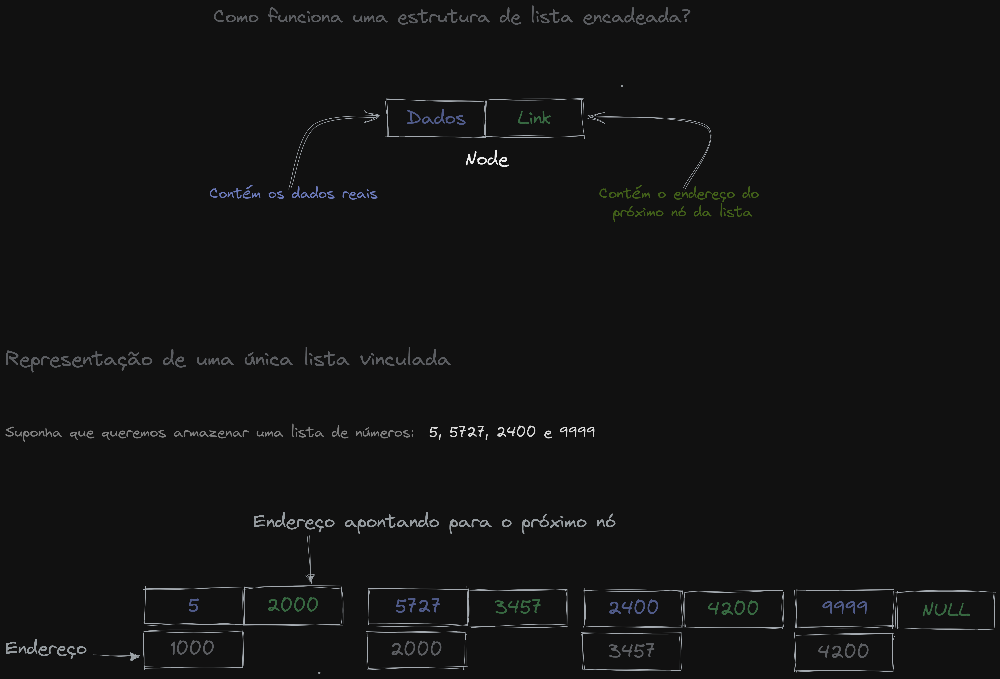

# A incrível lista encadeada 📜

Você já ouviu falar sobre a lista encadeada? Ela é uma estrutura de dados incrível e dinâmica que consiste em um conjunto de nós interligados através de ponteiros.

Cada nó da lista contém um campo de dado, que armazena um valor, e um campo de ponteiro, que aponta para o próximo nó da lista.

Mas como funciona isso tudo? Cada nó é como uma peça de um quebra-cabeça, e quando conectados através dos ponteiros, formam uma lista encadeada.

Os dados armazenados em uma lista encadeada podem ser de qualquer tipo, o que a torna uma estrutura de dados muito flexível. Além disso, é possível criar operações de inserção, remoção e busca na lista.

Uma das coisas mais legais da lista encadeada é que ela pode ser usada para implementar outras estruturas de dados, como pilhas e filas. Isso acontece porque essas estruturas podem ser construídas a partir das operações básicas da lista encadeada.

Mas cuidado! A travessia da lista encadeada pode ser um pouco trabalhosa, já que é preciso percorrer todos os nós até chegar ao nó desejado. Mas com um pouco de paciência e habilidade, você pode realizar operações incríveis com essa estrutura de dados.

Então, que tal experimentar criar sua própria lista encadeada? Com certeza você vai se surpreender com as possibilidades que ela oferece. 

## Logo abaixo um exemplo visual :

